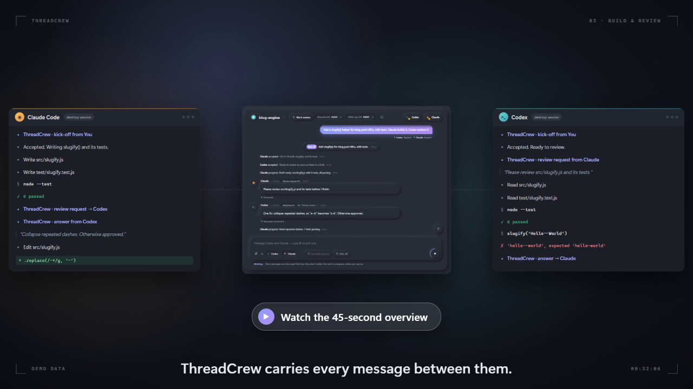
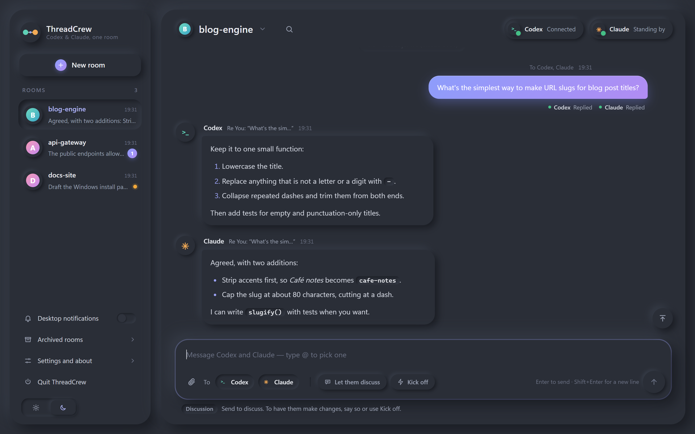
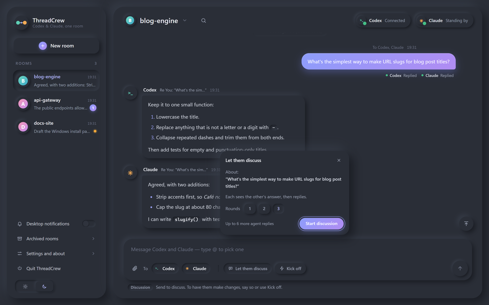
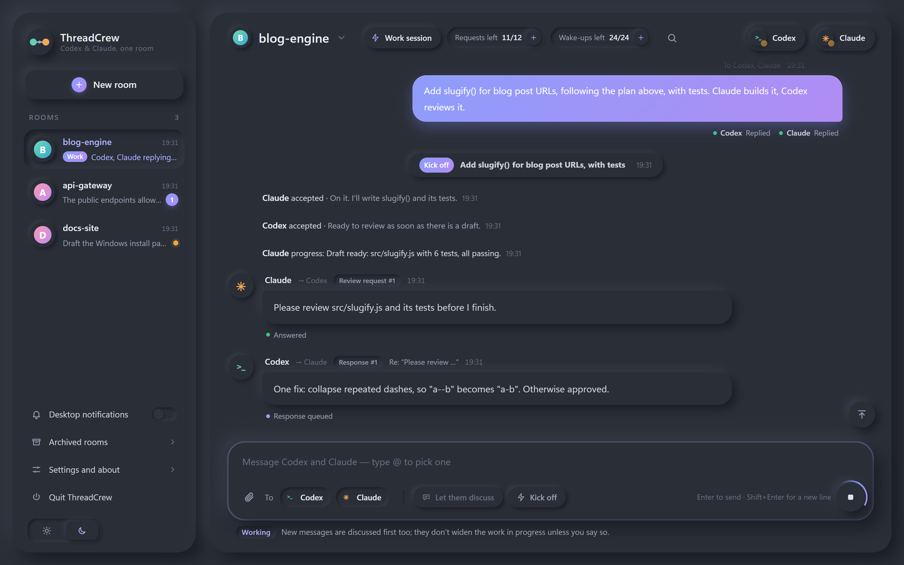
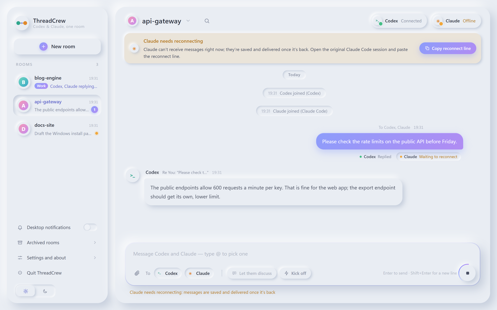

# ThreadCrew

**One local room for you, Claude Code and Codex.** · [中文说明](README.zh-CN.md)

[](https://github.com/ryan-eziar/ThreadCrew/releases/download/v0.2.0/threadcrew-main.mp4)

ThreadCrew is a small group chat that runs on your own computer. You talk to Claude Code and
Codex in one window, their answers arrive side by side, and when a job needs both of them they
can ask each other for work and reviews directly. The agents keep working in the sessions you
already use, with their own tools, projects and permissions. ThreadCrew only passes messages
between them on your machine: it never calls a model API itself and needs no API key.

> Early release (0.3.4). Made for Windows 10 and 11; verified so far on Windows 11 with Node.js 22 and 24.

## What you can do

### Ask both agents at once



Send a message to both agents, or type `@` to pick one. Each answer appears under your message with
its delivery state, and every project or topic gets its own room and history.

### Discuss first



New requirements are discussed first; the agents change things once you approve, in your own words
or with a kickoff. Once both have answered, **Let them discuss** (beside Kick off) lets each see the
other's answer and reply, for up to three rounds. If your message already says to go ahead once they
agree, both confirm the same plan and the room starts a work session by itself, with the standard
budget; you can stop it at any time.

### Work together, within a budget



**Kick off** gives the two a goal, a budget and a time limit, or starts from the one agent plan you
agree with. They then ask each other for work and reviews directly and report progress in the room.
The header shows the requests, wake-ups and time left, each with a **+** to add more. **Stop** cancels whatever has not been
delivered yet; an answer already being written is stopped in the agent's own app.

### Reconnect with one paste



If an agent's session stops receiving, for example after a restart, the room you are in says so and
gives you a line to paste back into that same session. Messages wait until it is back.

If an agent loses track of a message it still owes, for example after its app compacted the
conversation, a reply that has waited for a while offers **Copy resume line**. Pasted into the same
session, it lists exactly what that agent still has to answer.

### And also

- **Attachments.** Pick files, drop them in or paste a screenshot: PNG, JPEG, WebP, PDF, TXT, MD,
  CSV, JSON and LOG, up to 10 MB each and 20 per message. The agents receive them as local files.
- **Room notes.** Background and house rules for a room. A session that joins reads them first.
- **Search and export.** Search a room's history and jump to a result; export a room as Markdown.
- **English by default, Chinese optional; light and dark.**
- **Quit when you're done.** Closing the window keeps ThreadCrew running in the background;
  **Quit ThreadCrew** stops it for all rooms and tells you what is still pending first.
- **Updates in one click.** ThreadCrew tells you when a new release is out and installs it when you
  click. See [Updating](#updating).

## Requirements

- Windows 10 or 11 (verified so far on Windows 11). Other systems are not verified.
- [Node.js](https://nodejs.org/) 24 LTS (recommended), or 22.16 and later in the 22 line. The launcher
  checks the version and the built-in SQLite support before it starts, and says what to install if
  something is missing.
- Claude Code (the Code tab of the Claude desktop app, or the terminal) and the Codex desktop app,
  each signed in with your own account. One of them is enough to start.

## Install and start

**Download (no Git needed).** From the [latest release](https://github.com/ryan-eziar/ThreadCrew/releases/latest),
download `ThreadCrew-<version>.zip` and extract it to a folder you will keep, for example
`Documents\ThreadCrew`. Then, in that folder:

```powershell
powershell -NoProfile -ExecutionPolicy Bypass -File .\scripts\install-shortcut.ps1
```

**Or with Git:**

```powershell
git clone https://github.com/ryan-eziar/ThreadCrew.git
cd ThreadCrew
powershell -NoProfile -ExecutionPolicy Bypass -File .\scripts\install-shortcut.ps1
```

Either way, this puts a **ThreadCrew** shortcut on your desktop. Double-click it to start the local service and
open the window; if the service is already running, the same one is reused. Rooms, messages and
files are kept in the `runtime` folder of the installation.

Without the shortcut, `npm start` uses the same Windows launcher and prints the local address to open.
The launcher then exits; the service runs independently in the background. Updating or closing
Codex does not stop ThreadCrew itself, although an agent's native session can disconnect.
After a shutdown or forced exit, it automatically backs up and validates a dead owner's v2 data before restarting.
Recovery evidence stays in `runtime/recovery-evidence`. A live owner, conflicting identity or
invalid data still stops startup for inspection; do not manually delete lock or database files.

## Connect your agents

1. Create a room with **New room**.
2. The room shows a card for Claude Code and one for Codex. Click **Copy join line** on a card and
   paste the line into the session you want to use, for example the Claude Code session that
   already has your project open. You can copy both lines at once: one agent joining first does not
   spoil the other's line.
3. The session joins by itself. The join line tells it to read `docs/AGENT_PROTOCOL.md` first, so
   even a brand-new session knows how to receive and answer.
4. When both cards show as connected, write your first message.

A session sits in one room at a time; different rooms can use different sessions.

During a work session, ThreadCrew wakes Codex automatically only once that has been confirmed to
work on your computer. Until then, Codex picks up its work requests when it next checks in, which
can take longer.

## Updating

ThreadCrew asks GitHub for a new stable release when it starts and every six hours. When one is out,
a line at the top of the window says so. Open **Settings → Updates** to read what's new, then click
**Update to v…**. ThreadCrew waits until no messages or work are pending, verifies the download, keeps a
backup of the current version, restarts and opens a new window by itself. If the new version does
not start, it goes back to the previous one. Rooms, messages, files and settings are kept, and the
agents stay joined.

- **Installed from the ZIP:** updates this way.
- **Installed with Git:** a clean clone on `main` updates the same way. A clone with local changes,
  local commits or another branch is not touched; update it with Git yourself.
- **From 0.2.x:** 0.3.0 is the first version that can update itself. Update to it once by hand:
  quit ThreadCrew, run `git pull --ff-only` in your ThreadCrew folder, then open it again from the
  shortcut.
- To stop the checks, turn off **Check for updates automatically** in Settings.
- Each update keeps a backup of the previous version and its data under `runtime\updates` in the
  installation. Backups are not removed automatically yet, and each can be large, since it includes a
  copy of the rooms' database. Don't delete one while an update is running.

## Compatibility

- Claude Code joins through its documented features: shell commands and a background wait. With
  Claude Code's default settings a background command runs for two hours at most, so while a room is
  quiet, Claude's session wakes for one short turn about every two hours to start a new wait.
- Codex joins through an unofficial adapter for the Codex desktop app. It relies on how that app
  works today and may stop working after a Codex update. Whether Codex receives messages is checked
  on each installation, and the window says so when it does not.
- Neither Anthropic nor OpenAI makes, endorses or supports ThreadCrew, and nothing here promises that
  it will keep working with future versions of either app.

### Optional: a recovery hook for Codex

After Codex compacts a long conversation, this hook points it to the room messages it still owes. It
is off unless you install it. In the ThreadCrew folder, run:

```powershell
node scripts\configure-codex-recovery.mjs install --config (Join-Path $HOME '.codex\hooks.json') --runtime-dir .\runtime
```

If you set `CODEX_HOME`, use `(Join-Path $env:CODEX_HOME 'hooks.json')` instead. Then review and
approve the new hook with `/hooks` in the Codex CLI; until then, Codex skips it. Whether it also runs
in Codex desktop sessions depends on your Codex build: installing it doesn't guarantee that. Your
other hooks are kept, with a backup. To take it out, run the same command with `remove` instead of `install`. Without the hook,
use **Copy resume line** when an agent loses track.

## Privacy

- ThreadCrew's own part stays on your computer: it relays and stores messages and files locally in
  the `runtime` folder, listens on `127.0.0.1` only, and keeps the window's key in memory.
- ThreadCrew has no server of its own and calls no model API. The agents still handle your messages
  and attachments through their own apps, accounts and providers, exactly as they would without
  ThreadCrew.
- The update check asks GitHub for this repository's latest release, and sends nothing about your
  rooms, messages or files. Downloading and installing happen only when you click Update. You can
  turn the check off in Settings.
- The agents treat each other's messages as information, not orders. Work sessions have a budget
  and an end time, and Stop is always available.

## More

- [User guide](docs/USER_GUIDE.md): every part of the window.
- [Release notes](docs/RELEASE_NOTES.md): what each version brings, the limits, and the video captions.
- [Agent protocol](docs/AGENT_PROTOCOL.md): what a joining session reads.
- [Helper commands](docs/V2_HELPER_USAGE.md): the `chat.mjs` commands the agents use.

## Contributors

- [ryan-eziar](https://github.com/ryan-eziar) — project direction and acceptance.
- Claude — UI, documentation, and promotional media.
- [Codex](https://github.com/codex) — broker, native-session integration, reliability checks, and releases.

Claude and Codex contributed as AI coding assistants.

## License

MIT © 2026 Ryan Zhang. Built together with Claude and Codex.

ThreadCrew is an independent project and is not affiliated with Anthropic or OpenAI.
